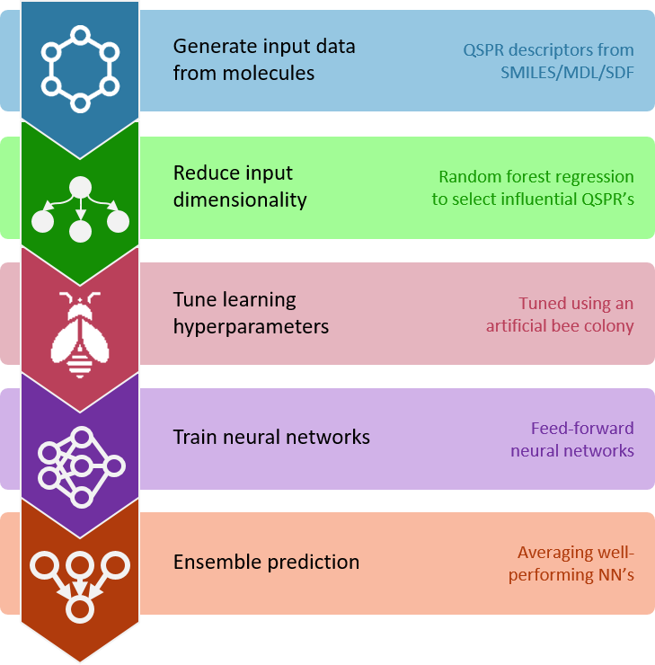

[](http://faculty.uml.edu/Hunter_Mack/)

# ECNet: scalable, retrainable and deployable machine learning projects for fuel property prediction

[](https://badge.fury.io/gh/tjkessler%2FECNet)
[](https://badge.fury.io/py/ecnet)
[](http://joss.theoj.org/papers/f556afbc97e18e1c1294d98e0f7ff99f)
[](https://raw.githubusercontent.com/TJKessler/ECNet/master/LICENSE.txt)
	
**ECNet** is an open source Python package for creating scalable, retrainable and deployable machine learning projects with a focus on fuel property prediction. An ECNet __project__ is considered a collection of __pools__, where each pool contains a neural network that has been selected from a group of __candidate__ neural networks. Candidates are selected to represent pools based on their ability to optimize certain learning criteria (for example, performing optimially on unseen data). Each pool contributes a prediction derived from input data, and these predictions are averaged to calculate the project's final prediction. Using multiple pools allows a project to learn from a variety of learning and validation sets, which can reduce the project's prediction error. Projects can be saved and reused at a later time allowing additional training and deployable predictive models. 

[T. Sennott et al.](https://doi.org/10.1115/ICEF2013-19185) have shown that neural networks can be applied to cetane number prediction with relatively little error. ECNet provides scientists an open source tool for predicting key fuel properties of potential next-generation biofuels, reducing the need for costly fuel synthesis and experimentation.

<p align="center">
  
</p>

Using ECNet, [T. Kessler et al.](https://doi.org/10.1016/j.fuel.2017.06.015) have increased the generalizability of neural networks to predict the cetane number for a variety of molecular classes represented in our [cetane number database](https://github.com/TJKessler/ECNet/tree/master/databases), and have increased the accuracy of neural networks for predicting the cetane number of underrepresented molecular classes through targeted database expansion.

Future plans for ECNet include:
- distributed candidate training for GPU's
- a graphical user interface
- implementing neural network neuron diagnostics - maybe it's not a black box after all 🤔

# Installation:

### Prerequisites:
- Have Python 3.5/3.6 installed
- Have the ability to install Python packages

### Method 1: pip
If you are working in a Linux/Mac environment:
```
sudo pip install ecnet
```

Alternatively, in a Windows or virtualenv environment:
```
pip install ecnet
```

Note: if multiple Python releases are installed on your system (e.g. 2.7 and 3.6), you may need to execute the correct version of pip. For Python 3.6, change **"pip install ecnet"** to **"pip3 install ecnet"**.

### Method 2: From source
Download the ECNet repository, navigate to the download location on the command line/terminal, and execute:
```
python setup.py install
```

Additional package dependencies (ColorLogging, Ditto, Keras, NumPy, PubChemPy, PyYaml, TensorFlow) will be installed during the ECNet installation process. If raw performance is your thing, consider building numerical packages like TensorFlow and NumPy from source.

To update your version of ECNet to the latest release version, use:
```
pip install --upgrade ecnet
```

# Usage:

ECNet operates using a **Server** object that interfaces with data utility classes, error calculation functions, and neural network creation classes. The Server object handles importing data and model creation for your project, and serves the data to models. Configurable variables for neural networks, such as learning rate, number of neurons per hidden layer, activation functions for hidden/input/output layers, and number of training epochs are found in a **.yml** configuration file.

## Configuration .yml file format and variables

For training, we apply the Adam optimization algorithm to feed-forward neural networks. Here is the default model configuration:

```yml
---
beta_1: 0.9
beta_2: 0.999
decay: 0.0
epochs: 2000
epsilon: 0.0000001
hidden_layers:
- - 32
  - relu
- - 32
  - relu
learning_rate: 0.001
output_activation: linear
```

And brief explanations of each of these variables:

| Variable Name 	| Format/Type 	| Description 	|
|-------------------	|------------------------------------------	|--------------------------------------------------------------------------	|
| beta_1 	| float [0, 1) 	| Exponential decay rate for first-moment estimates 	|
| beta_2 	| float [0, 1) 	| Exponential decay rate for second-moment estimates 	|
| decay 	| float [0,) 	| Initial learning rate decay 	|
| epochs 	| int [0,) 	| Number of training iterations/maximum number of iterations if validating 	|
| epsilon 	| float [0,) 	| Small number to prevent division by zero 	|
| hidden_layers 	| [[n_neur, activ], ...,  [n_neur, activ]] 	| Sizes and activation functions for hidden layers 	|
| learning_rate 	| float [0,) 	| Learning rate of training algorithm 	|
| output_activation 	| string 	| Activation function of the output layer 	|

## Using the Server object

To get started, create a Python script to handle your task and copy an ECNet-formatted CSV database file to your working directory. The Server object will create a default configuration file if an existing one is not specified or found. Example scripts, configuration files, and databases are provided ([examples/config](examples/), [databases](databases/)).

Your first steps are importing the Server object, initializing the Server and importing some data:

```python
from ecnet import Server

# Initialize a Server
sv = Server()

# If `config.yml` does not already exist in your working directory, it will be created with
#   default values; to specify another configuration file, use the model_config argument
sv = Server(model_config='my_model_configuration.yml')

# You can utilize parallel processing (multiprocessing) for model training and hyperparameter
#   tuning:
sv = Server(num_processes=4)
sv.num_processes = 8

# Import an ECNet-formatted CSV database
sv.load_data('my_data.csv')

# Learning, validation and test sets are defined in the database's ASSIGNMENT column; to use
#   random set assignments, supply the `random` and `split` arguments:
sv.load_data(
    'my_data.csv',
    random=True,
    split=[0.7, 0.2, 0.1]
)
# 70% of data is in the learning set, 20% in the validation set and 10% in the test set
```

ECNet utilizes console and file logging - by default, it will not log anything to either the console or a file. To enable logging functionality, we can use ECNet's logger:

```python
from ecnet.utils.logging import logger

# Available levels are `debug`, `info`, `warn`, `error`, `crit`, `disable`

# Set the console log level to `info`:
logger.stream_level = 'info'

# Set the file log level to `info`:
logger.file_level = 'info'

# Specify a directory to save log files:
logger.log_dir = 'path\to\my\log\directory'
```

You can change all the model configuration variables from your Python script without having to edit and re-open your model configuration file:

```python
# Configuration variables are found in the Server's '._vars' dictionary
sv._vars['learning_rate'] = 0.05
sv._vars['beta_2'] = 0.75
sv._vars['hidden_layers'] = [[32, 'relu'], [32, 'relu']]
sv._vars['epochs'] = 10000
```

Optimal input dimensionality, i.e. finding a balance between runtime and precision/accuracy, is often beneficial. To limit input dimensionality to a specified number of influential input parameters, ECNet utilizes random forest regression:

```python
# Find the 15 most influential input parameters
sv.limit_inputs(15)

# Find the 15 most influential input parameters, and save them to an ECNet-formatted database:
sv.limit_inputs(15, db_filename='my_limited_data.csv')
```

Optimal hyperparameters are essential for mapping inputs to outputs during neural network
training. ECNet utilizes an artificial bee colony, [ECabc](https://github.com/ecrl/ecabc), to optimize hyperparameters such as
learning rate, beta, decay and epsilon values, and number of neurons per hidden layer:

```python
# Tune hyperparameters for 50 iterations (search cycles) with 50 employer bees:
sv.tune_hyperparameters(50, 50)

# By default, all bees will use the same set assignments; to shuffle them:
sv.tune_hyperparameters(50, 50, shuffle=True, split=[0.7, 0.2, 0.1])

# By default, bees are evaluated on their performance across all sets; to specify a set to
#   perform the evaluation:
sv.tune_hyperparameters(50, 50, eval_set='test')
# Available sets are `learn`, `valid`, `train`, `test`, None (all sets)

# The ABC will measure error using RMSE; to change the error function used:
sv.tune_hyperparameters(50, 50, eval_fn='mean_abs_error')
# Available functions are `rmse`, `mean_abs_error`, `med_abs_error`
```

ECNet is able to create an ensemble of neural networks (candidates chosen from pools) to
predict a final value for the project. Projects can be saved and used at a later time.


```python
# Create a project 'my_project' with 5 pools, 75 candidates per pool:
sv.create_project(
    'my_project',
    num_pools=5,
    num_candidates=75,
)

# Train neural networks using the number of epochs in your configuration file:
sv.train()

# To use periodic validation (training halts when validation set performance stops improving),
#   supply the validate argument:
sv.train(validate=True)

# We can shuffle either 'train' (learning and validation) or 'all' sets with the shuffle
#   argument and a split:
sv.train(
    shuffle='train',
    split=[0.7, 0.2, 0.1]
)

# We can retrain pre-existing candidates:
sv.train(retrain=True)

# By default, best neural networks are selected from pools based on their performance on all
#   sets; to specify a set used for evaluation:
sv.train(selection_set='test')
# Available sets are `learn`, `valid`, `train`, `test`, None (all sets)

# By default, candidates are evaluated by measuring their RMSE on the supplied set; to specify
#   another error function:
sv.train(selection_fn='mean_abs_error')
# Available functions are `rmse`, `mean_abs_error`, `med_abs_error`

# Save your project
sv.save_project()

# You can save it with a name other than the one assigned
sv.save_project(filename='path/to/my/save.prj')

# When a project is saved, it will remove the folder structure it originated from; if this is
#   unwanted:
sv.save_project(clean_up=False)

# A saved project contains all candidate neural networks, even if they have not been selected;
#   to remove all non-chosen candidate neural networks:
sv.save_project(del_candidates=True)

# Predict values for the test set:
test_results = sv.use(dset='test')
# You can predict for 'learn', 'valid', 'train', 'test', or None (all) sets

# If you want to save these results to a CSV file, supply the output_filename argument
sv.use(dset='test', output_filename='my/test/results.csv')

# Calculates errors for the test set (any combination of these error functions can be supplied as
#   arguments, and any dset listed above)
test_errors = sv.errors('rmse','r2','mean_abs_error','med_abs_error', dset='test')
```

Once you save a project, the .prj file can be used at a later time:

```python
from ecnet.server import Server

# Specify a 'prj_file' argument to open a pre-existing project
sv = Server(prj_file='my_project.prj')

# Open an ECNet-formatted database with new data
sv.load_data('new_data.csv')

# Save results to output file
#  - NOTE: no 'dset' argument for 'use_model' defaults to using all currently loaded data
sv.use(output_filename='my/new/test/results.csv')
```
To view more examples of common ECNet tasks such as hyperparameter optimization and input dimensionality reduction, view the [examples](examples/) directory. For additional documentation on Server methods and lower-level usage view the README in the [ecnet](ecnet/) directory.

# Database Format:

ECNet databases are comma-separated value (CSV) formatted files that provide information such as the ID of each data point, an optional explicit sort type, various strings and groups to identify data points, target values and input parameters. Row 1 is used to identify which columns are used for ID, explicit sorting assignment, various strings and groups, and target and input data, and row 2 contains the names of these strings/groups/targets/inputs. Additional rows are data points.

The [databases](databases/) directory contains databases for cetane number, cloud point, kinetic viscosity, pour point and yield sooting index, as well as a database template.

You can create an ECNet-formatted database with molecule names or SMILES and (optionally) target values. The following programs must be installed for you to do so:
- [Open Babel](http://openbabel.org/wiki/Main_Page) software
- [Java JRE](https://www.oracle.com/technetwork/java/javase/downloads/jre8-downloads-2133155.html) version 6 and above

Supplied names or SMILES must exist in a text file, one entry per line:
```
Acetaldehyde
Acetaldehyde dimethyl acetal
Acetic acid
Acetic anhydride
Acetol
Acetone
Acetonitrile
Acetonylacetone
```

If target values are supplied, they must also exist in a text file (of equal length to the supplied names or SMILES):
```
70
147
244
284
295
133
180
376
```

The database can then be constructed with:
```python
from ecnet.tools.database import create_db

create_db('names.txt', 'my_database.csv', targets='targets.txt')
```

If SMILES strings are supplied instead of names:
```python
from ecnet.tools.database import create_db

create_db('smiles.txt', 'my_database.csv', targets='targets.txt', form='smiles')
```

Your database's DATAID column (essentially Bates numbers for each molecule) will increment starting at 0001:

| DATAID 	|
|--------	|
| DATAID 	|
| 0001   	|
| 0002   	|
| 0003   	|

If a prefix is desired for these values, specify it with:
```python
from ecnet.tools.database import create_db

create_db('names.txt', 'my_database.csv', targets='targets.txt', id_prefix='MOL')
```

| DATAID 	    |
|-----------	|
| DATAID     	|
| MOL0001   	|
| MOL0002   	|
| MOL0003   	|

# Contributing, Reporting Issues and Other Support:

To contribute to ECNet, make a pull request. Contributions should include tests for new features added, as well as extensive documentation.

To report problems with the software or feature requests, file an issue. When reporting problems, include information such as error messages, your OS/environment and Python version.

For additional support/questions, contact Travis Kessler (travis.j.kessler@gmail.com), Hernan Gelaf-Romer (hernan_gelafromer@student.uml.edu) and/or John Hunter Mack (Hunter_Mack@uml.edu).
