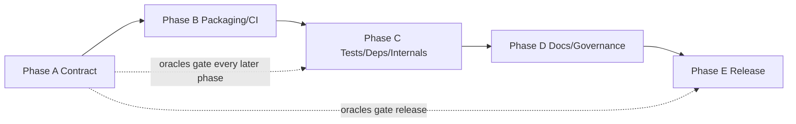

# ECNet: API-stable modernization of QSPR-based fuel property prediction

**Design Document — v0.1**  
**Status:** Approved (2026-07-21)  
**Package:** `ecnet` (PyPI / import name unchanged)  
**License:** MIT (unchanged)  
**Current release baseline:** `4.1.4` (2024-08-29)  
**First modernization tag:** `4.1.5` (after Phases A and B)

---

## 1. Summary

ECNet is an open-source Python package for building multilayer-perceptron models that predict fuel properties from molecular structure using quantitative structure–property relationship (QSPR) descriptors. It ships bundled property datasets (cetane number, yield sooting index, research/motor octane number, and related targets), integrates PaDEL and alvaDesc descriptor backends, provides hyperparameter-tuning helpers, and includes analytical blend-property equations.

The package already has a JOSS paper and a published PyPI history, but repository engineering has lagged: thin tests, pinned vulnerable dependencies, deprecated version introspection, sparse governance files, and documentation that partially describes an older architecture.

The present work modernizes packaging, testing, CI, documentation, governance, dependency hygiene, and selected internals **without changing the public API contract**. Downstream code that imports the current callables and classes must continue to work with identical signatures, default behaviors, return shapes, and primary exception types within the `4.1.x` / `4.2.x` compatibility series.

This document is the design source of truth for a five-phase modernization program (Phases A–E).

---

## 2. Motivation and problem statement

### 2.1 Current landscape

Fuel property prediction from molecular descriptors remains a practical need in combustion and biofuel screening. ECNet provides a PyTorch-based regression path over QSPR inputs plus domain-specific blend mixing rules. Empirically, the package is installable and its existing seventeen tests pass under a constrained environment, but several engineering gaps limit safe maintenance:

| Area | Current state (baseline `4.1.4`) |
|------|----------------------------------|
| Public API | `ECNet`, dataset loaders/classes, tasks, blends, callbacks — stable in practice |
| Layout | Flat `ecnet/` package (not `src/`); ~1.8k lines of Python |
| Tests | Single `tests/test_all.py` (17 tests); ~66% line coverage; **`ecnet.blends` at 0%**; `Validator` test is a no-op |
| Versioning | `pkg_resources` in `ecnet/__init__.py` (broken on setuptools ≥82; deprecated) |
| Dependencies | Exact pins (`torch==2.4.0`, `scikit-learn==1.5.1`, …); multiple known torch advisories |
| Tooling | No `[dev]`/`[docs]` extras; no ruff/pre-commit; no coverage floor |
| CI | Single Python 3.11 job on push; outdated Actions majors; no coverage gate; no recorded runs observed |
| Docs | MkDocs + mkdocstrings stubs; JOSS `paper.md` (2017) describes a project/build/node architecture not present in v4 |
| Governance | No CONTRIBUTING, CHANGELOG, CITATION.cff, SECURITY, CODE_OF_CONDUCT, issue/PR templates |
| Hygiene | No standard Python `.gitignore` content historically; tests write temp files into the working tree; `.DS_Store` tracked under package data |
| Data | Bundled `.smiles`/`.target` property sets in-package; large `databases/` CSVs (~64 MB) in the git tree |
| Publishing | Long-lived `PYPI_API_TOKEN` in release workflow |

### 2.2 Why now

1. Downstream users and notebooks rely on import stability; modernization debt raises the cost of every dependency or bugfix.
2. Version introspection already fails under current setuptools; that is a hard install-time regression for some environments.
3. Exact torch pins block security updates and complicate fresh installs as wheels age.
4. Coverage gaps (especially blends and public loaders) make internal refactors and dependency bumps unsafe.
5. A compatibility-preserving modernization is cheaper than an API rewrite that would strand existing example notebooks and papers citing the current API.

### 2.3 Non-goals

The following are explicitly out of scope for Phases A–E:

1. **Changing the public API** — no renamed exports, no required new arguments, no change to return container types or primary exception types for documented failure modes.
2. **Replacing the default QSPR backend** — PaDEL remains the default (`backend='padel'`); alvaDesc remains optional via existing paths.
3. **Reintroducing the pre-v4 project/build/node ensemble architecture** as the primary API (historical JOSS description may be archived or clarified, not resurrected as the default surface).
4. **Mandatory GUI** or web service.
5. **Hard dependency on RDKit or Mordred** in the default install (optional additive backends may be sketched in Phase E only if they do not alter existing defaults).
6. **JOSS resubmission** as a required deliverable of Phases A–E (citation metadata and docs alignment are in scope; a new paper is not).
7. **Changing bundled property dataset contents** without an explicit, versioned data revision and migration note.

---

## 3. What's genuinely new

This program is an engineering modernization of an existing scientific package, not a new property-prediction algorithm. Differentiation relative to a rewrite is:

1. **Frozen-contract modernization** — tooling, tests, CI, docs, and internals improve while `import ecnet` and documented subpackage exports remain drop-in compatible.
2. **Characterization tests as release gates** — signature locks and numeric oracles (especially blend equations and seeded training smoke tests) must stay green across dependency and internal changes.
3. **Dependency ranges with a CI matrix** — move from brittle exact pins to supported ranges while proving behavior on multiple Python versions.
4. **Production packaging baseline** — modern extras, coverage floor, multi-version CI, Sphinx + Furo, governance files, and trusted PyPI publishing.
5. **Explicit stability policy** — additive optional kwargs and clearer errors are allowed; behavior changes that alter predictions or descriptor schemas require a documented version bump strategy.

---

## 4. Goals

Numbered goals are testable exit criteria for the modernization program.

1. **G1 — API contract suite.** CI fails if public signatures change or if blend/dataset/model characterization oracles regress beyond documented tolerances.
2. **G2 — Version and packaging.** `ecnet.__version__` resolves via `importlib.metadata`; `[dev]` and `[docs]` extras install; `python -m build` succeeds; classifiers list supported Python versions.
3. **G3 — Tooling and quality gates.** ruff lint/format, pytest-cov with a documented coverage floor, and pre-commit are enforced in CI.
4. **G4 — CI matrix.** Push/PR CI runs lint + tests on Python 3.11–3.12 (3.13 when torch wheels allow); coverage reported; Actions kept current.
5. **G5 — Test depth.** `ecnet.blends` ≥95% line coverage; overall package line coverage **≥90%**; no stub tests; public `load_*` loaders and `Validator` exercised; tests use isolated temp paths.
6. **G6 — Dependency hygiene.** Compatible version ranges replace exact pins where safe; `pip-audit` clean or documented exceptions; Dependabot (or equivalent) enabled.
7. **G7 — Documentation.** User-facing docs describe the **current** v4 API; install + quickstart + API reference build with warnings as errors; JOSS historical architecture clearly labeled as prior generation.
8. **G8 — Governance.** CONTRIBUTING, CHANGELOG, CITATION.cff, SECURITY, CODE_OF_CONDUCT, and issue/PR templates present.
9. **G9 — Release path.** Trusted publishing (OIDC) replaces long-lived tokens; a compatibility release ships only after gates for that milestone pass.
10. **G10 — Data provenance.** Bundled property datasets have dataset cards (scope, units, provenance, license notes); top-level `databases/` stays out of wheels and is documented as a non-install research archive.

---

## 5. Target users and use cases

| User | Use case |
|------|----------|
| Combustion / biofuel researcher | Train or evaluate QSPR models for CN, YSI, RON/MON, and related properties |
| Blend analyst | Combine component property predictions with analytical blend equations |
| Pipeline author | Embed `ECNet` and dataset loaders in an existing PyTorch workflow |
| Library integrator | Depend on `ecnet` from PyPI without adapting to API churn |
| Maintainer / contributor | Run lint/tests locally and in CI; cut safe patch/minor releases |

**Primary constraint:** integrators and existing notebooks must not need code changes when upgrading within the compatibility series.

---

## 6. Related work

| Project | What it does | Status | Gap this package fills |
|---------|--------------|--------|------------------------|
| [DeepChem](https://deepchem.io/) | Broad cheminformatics / ML toolkit | Active | General-purpose; not fuel-property-focused with bundled combustion datasets and blend equations |
| [Chemprop](https://chemprop.readthedocs.io/) | Message-passing NNs for molecular property prediction | Active | Different model class (graph MPNN); not QSPR-descriptor MLP + fuel blend helpers |
| [RDKit](https://www.rdkit.org/) + scikit-learn / PyTorch | Descriptor/fingerprint generation + custom models | Ecosystem standard | Requires assembling datasets, blend rules, and training loops; ECNet packages a fuel-oriented path |
| [Mordred](https://doi.org/10.1186/s13321-018-0258-y) | Descriptor calculator | Active alternative engine | Complementary; not a fuel modeling package |
| [PaDEL-Descriptor](https://doi.org/10.1002/jcc.21707) / [PaDELPy](https://github.com/ecrl/padelpy) | Descriptor engine and Python wrapper | Mature | Upstream descriptor generation; ECNet consumes descriptors for prediction |

**Primary literature to cite where methods are discussed (docstrings, Sphinx, tests, `paper.bib` as applicable):**

- Yap CW. PaDEL-Descriptor. *J Comput Chem.* 2011 — descriptor backend.
- Blend mixing rules as already cited in `ecnet/blends/predict.py` (NREL CN blending; Semwal et al. for cloud point; Ding et al. for kinematic viscosity; LHV and YSI DOIs in module docstrings).
- Prior ECNet JOSS paper and fuel-property ANN literature already listed in `paper/paper.bib` — retain for historical citation; do not treat the 2017 architecture description as the current API.

---

## 7. Architecture overview

ECNet remains a **layered scientific ML package**. Modernization may refine helpers and packaging layout but must preserve the import surface.

```text
+------------------------------------------------------------------+
|  Public API                                                      |
|  ecnet.ECNet, ecnet.model.load_model, ecnet.__version__          |
|  ecnet.datasets (load_*, QSPRDataset*)                           |
|  ecnet.tasks (select_rfr, tune_*)                                |
|  ecnet.blends (property blend predictors + selected errors)      |
|  ecnet.callbacks (LRDecayLinear, Validator, ...)                 |
+--------------------------------+---------------------------------+
                                 |
         +-----------------------+-----------------------+
         v                       v                       v
+----------------+     +------------------+     +------------------+
| L3 Application |     | L2 Domain        |     | L2 Domain        |
| tasks/         |---->| model +          |     | blends/          |
| feature sel.   |     | callbacks        |     | equations        |
| param tuning   |     +--------+---------+     +------------------+
+--------+-------+              |
         |                      v
         |             +------------------+
         +------------>| L1 Datasets      |
                       | structs, loaders |
                       | QSPR backends    |
                       +--------+---------+
                                v
                       +------------------+
                       | L0 Data + deps   |
                       | bundled SMILES/  |
                       | targets; torch;  |
                       | sklearn; padel;  |
                       | alvadesc; ecabc  |
                       +------------------+
```
**Dependency rule:** Higher layers may import lower layers; L1 must not import L3; `blends` must remain free of torch training code (pure numeric helpers). New helpers stay private (`_`-prefixed) unless deliberately re-exported.

**Layout decision (approved):** Migrate to `src/ecnet/` in **Phase B**. The import name remains `import ecnet`. Package data (`.smiles` / `.target`) must continue to ship in sdists and wheels.

---

## 8. Core data model and public API

### 8.1 Frozen public surface

```python
from ecnet import ECNet, __version__
from ecnet.model import load_model

from ecnet.datasets import (
    load_bp, load_cn, load_cp, load_kv, load_lhv,
    load_mon, load_mp, load_pp, load_ron, load_ysi,
    QSPRDataset, QSPRDatasetFromFile, QSPRDatasetFromValues,
)

from ecnet.tasks import (
    select_rfr, tune_batch_size, tune_model_architecture, tune_training_parameters,
)

from ecnet.blends import (
    cetane_number, yield_sooting_index, kinematic_viscosity,
    cloud_point, lower_heating_value,
    linear_blend_err, exponential_blend_err, kv_error,
)

from ecnet.callbacks import LRDecayLinear, Validator, Callback, CallbackOperator
```

`PCADataset` exists in source today but is **not** re-exported from `ecnet.datasets`. **Approved:** keep the advanced import `ecnet.datasets.structs.PCADataset` unless examples are updated to require a public re-export; only then add it to `ecnet.datasets.__init__` in Phase B (additive). Characterization tests may cover it via the structs import without changing `__init__` exports by default.

### 8.2 Signature contracts (preserve)

```python
class ECNet(nn.Module):
    def __init__(
        self,
        input_dim: int,
        output_dim: int,
        hidden_dim: int,
        n_hidden: int,
        dropout: float = 0.0,
        device: str = "cpu",
    ): ...

    def fit(
        self,
        smiles: list[str] | None = None,
        target_vals: list[list[float]] | None = None,
        dataset: QSPRDataset | None = None,
        backend: str = "padel",
        batch_size: int = 32,
        epochs: int = 100,
        lr_decay: float = 0.0,
        valid_size: float = 0.0,
        valid_eval_iter: int = 1,
        patience: int = 16,
        verbose: int = 0,
        random_state: int | None = None,
        shuffle: bool = False,
        **kwargs,  # Adam optimizer kwargs
    ) -> tuple[list[float], list[float]]: ...

    def forward(self, x: torch.Tensor) -> torch.Tensor: ...
    def save(self, model_filename: str) -> None: ...

def load_model(model_filename: str) -> ECNet: ...

def load_<prop>(as_dataset: bool = False, backend: str = "padel"): ...
# prop ∈ {bp, cn, cp, kv, lhv, mon, mp, pp, ron, ysi}

def select_rfr(dataset: QSPRDataset, total_importance: float = 0.95, ...): ...
def tune_batch_size(n_bees: int, n_iter: int, dataset_train, dataset_eval, n_processes, ...): ...
def tune_model_architecture(...): ...
def tune_training_parameters(...): ...

def cetane_number(values: list[float], vol_fractions: list[float]) -> float: ...
def cloud_point(values: list[float], vol_fractions: list[float]) -> float: ...  # °C in / °C out
def kinematic_viscosity(values: list[float], vol_fractions: list[float]) -> float: ...  # cSt
def lower_heating_value(values: list[float], vol_fractions: list[float]) -> float: ...
def yield_sooting_index(values: list[float], vol_fractions: list[float]) -> float: ...
```

Additive optional keyword arguments are allowed if defaults preserve today’s behavior.

### 8.3 Units and numeric conventions

| Quantity | Canonical unit in public API | Notes |
|----------|------------------------------|-------|
| Cloud point blend I/O | °C | Internal Rankine conversion must remain consistent |
| Kinematic viscosity | cSt | Per Ding et al. mixing rule already implemented |
| Cetane number, YSI, LHV, octane numbers | Dimensionless property scales as in bundled targets | Document in dataset cards |
| Model targets | As supplied by user / bundled `.target` files | No silent unit conversion in `ECNet.fit` |

Numerical assertions use `pytest.approx` with tolerances justified per test (blends: tight absolute/relative tolerances on algebraic results; training smoke tests: finite losses and monotonic-enough decrease under fixed seeds — not literature accuracy claims).

### 8.4 Stability policy

1. **Patch (`4.1.x`):** bugfixes, packaging, tests, docs corrections; oracles must match.
2. **Minor (`4.2.0`):** internal hardening, Sphinx/governance completion, dependency range expansions proven on CI; still API-compatible.
3. **Major (`5.0.0`):** only with explicit approval — e.g. removing pickle-based full-module `torch.load`, changing default descriptor backends, or altering bundled dataset schemas.

---

## 9. Module design

### 9.1 `ecnet` (`__init__.py`)

**Purpose:** Export `ECNet` and `__version__`.  
**Changes:** Replace `pkg_resources` with `importlib.metadata.version("ecnet")`; add explicit `__all__`.

### 9.2 `ecnet.model`

**Purpose:** `ECNet` MLP, training loop, save/load.  
**Preserve:** Constructor args; `fit` defaults; MSE loss; ReLU between layers; validation/early-stopping semantics when `valid_size > 0`.  
**Internal improvements (Phase C):** `load_model` shim that accepts legacy full-module `.pt` pickles and a newer state-dict format, without changing the `load_model(path)` signature; avoid CWD pollution; keep `save` requiring `.pt` extension (prefer writing the new format going forward while remaining able to read legacy files).

### 9.3 `ecnet.datasets`

**Purpose:** QSPR dataset types, property loaders, PaDEL/alvaDesc utilities.  
**Preserve:** Loader names and `(smiles, targets)` vs `QSPRDataset` return modes; default `backend='padel'`.  
**Improvements:** Dataset cards (Phase D/G10); tests for all `load_*`; document `PCADataset` export policy.

### 9.4 `ecnet.tasks`

**Purpose:** Random-forest feature selection and ABC-based hyperparameter tuning (`ecabc`).  
**Preserve:** Function names and return dict key structures used by callers/tests.  
**Tests:** Keep short-iteration tuning tests; mark slow variants if expanded.

### 9.5 `ecnet.blends`

**Purpose:** Analytical blend property predictors and error propagation helpers.  
**Preserve:** Equations and units.  
**Priority:** Highest test value in Phase A (pure functions, currently 0% coverage).

### 9.6 `ecnet.callbacks`

**Purpose:** Training callbacks (`LRDecayLinear`, `Validator`, operator plumbing).  
**Preserve:** Callback method contracts used by `ECNet.fit`.  
**Tests:** Replace the no-op `Validator` test with a real early-stopping characterization test.

### 9.7 `databases/` (repo root)

**Purpose today:** Large CSV masters + filter script; not part of the installed wheel.  
**Approved:** keep out of wheels and sdists as a non-install research archive; add a README/dataset card clarifying that role (Phase D / G10). Do not silently bundle into PyPI artifacts.

---

## 10. Dependencies and ecosystem integration

| Kind | Decision |
|------|----------|
| Runtime | `torch`, `scikit-learn`, `padelpy`, `alvadescpy`, `ecabc` — retain; convert exact `==` pins to compatible ranges after characterization suite exists |
| System / external | alvaDesc license for `backend='alvadesc'`; Java for PaDEL via padelpy |
| Optional extras | `[dev]` — pytest, pytest-cov, ruff, pre-commit, build, pip-audit; `[docs]` — Sphinx + Furo (+ napoleon, autodoc, myst as needed) |
| Future optional extras (Phase E sketch only) | `[rdkit]` / fingerprint backends — additive; default backend unchanged |
| Bundled artifacts | `.smiles` / `.target` property files via package data |

No new hard runtime dependencies in Phases A–D without a separate maintainer decision.

---

## 11. Validation strategy

### 11.1 Phase A — Contract suite (load-bearing)

| Test class | What | Pass criteria |
|------------|------|---------------|
| Signature locks | `inspect.signature` on public callables/classes | Parameter names + defaults match frozen contract |
| Blend oracles | Fixed component values + volume fractions for CN, CP, KV, LHV, YSI | Algebraic results within tight `pytest.approx` tolerances; cite equation sources in test comments |
| Blend error helpers | `linear_blend_err`, `exponential_blend_err`, `kv_error` | Numeric checks vs hand-computed fixtures |
| Dataset loaders | Each `load_*` | Equal smiles/target lengths; types; optional `as_dataset=True` smoke |
| Dataset structs | `QSPRDataset`, `FromFile`, `FromValues` | Existing descriptor-count checks retained (`1875` for default PaDEL path) |
| Callbacks | `LRDecayLinear`, `Validator` | Decay stops at expected epoch; validator triggers patience behavior on synthetic loaders |
| Model | construct / short `fit` / save-load | Seeded finite losses; round-trip prediction equality for saved weights under documented load policy |
| Tasks | `select_rfr`, tune helpers with `n_iter=1` | Existing structural assertions retained |

Store numeric fixtures under `tests/fixtures/` with a short README (engine/self-consistency vs literature oracles clearly labeled).

### 11.2 Coverage targets

| Scope | After Phase A | After Phase B CI gate | After Phase C |
|-------|---------------|----------------------|---------------|
| `ecnet.blends` | ≥95% | ≥95% | ≥95% |
| Package overall (`ecnet/**`) | Path to **90%** (raise aggressively) | **≥90%** fail-under | **≥90%** maintained |
| Stub tests | Forbidden | Forbidden | Forbidden |

**Approved coverage aim:** overall package line coverage **90%** (blends ≥95%). Phase A builds the suite needed to hit 90%; Phase B enforces fail-under in CI.

### 11.3 Integration / notebooks

- Keep descriptor-backed tests that invoke PaDEL as integration tests (may be slower); default CI must remain reliable on Ubuntu.
- Existing `examples/*.ipynb` are refreshed in Phase D; optional `nbmake` smoke in CI once notebooks are deterministic enough.

### 11.4 CI gates

Lint (ruff) → tests + coverage floor → docs build (once Sphinx exists in Phase D). Release workflow builds artifacts and publishes via OIDC.

---

## 12. Open-source packaging

| Concern | Decision |
|---------|----------|
| Build backend | setuptools via `pyproject.toml` (current) |
| Layout | `src/ecnet/` in Phase B |
| Python versions | `requires-python = ">=3.11"`; CI on 3.11 and 3.12; add 3.13 when torch supports it in-range |
| License | MIT |
| Docs | Migrate MkDocs → Sphinx + Furo under `docs/source/` in Phase D; update `.readthedocs.yaml` |
| CI | `.github/workflows/ci.yml` — lint + test matrix on push/PR |
| Release | Tag/release-triggered publish with PyPI trusted publishing |
| Governance | CONTRIBUTING, CODE_OF_CONDUCT, CHANGELOG, SECURITY, issue/PR templates |
| Citation | `CITATION.cff` for the software; retain JOSS citation guidance in README |
| Supply chain | Current Actions; Dependabot; no secrets in repo; drop long-lived PyPI token |
| FAIR data | Dataset cards for bundled property sets (`fair_data` profile intent) |

---

## 13. Roadmap (Phases A–E)

| Phase | Theme | Primary goals | Suggested version |
|-------|-------|---------------|-------------------|
| **A** | Freeze the contract | G1, G5 path — signature locks, blend oracles, loader/Validator tests; blends ≥95%; overall on path to **90%** | Commits on `4.1.4` tip (no tag yet) |
| **B** | Modernize the shell | G2, G3, G4 — `importlib.metadata`, extras, `src/` layout, ruff/pre-commit, CI matrix, **90%** coverage gate | Tag **`4.1.5`** after A+B |
| **C** | Tests, deps, internals | G5, G6 — maintain ≥90%; torch/sklearn ranges; legacy+state-dict `load_model` shim; temp-path hygiene | `4.1.6` or fold into `4.2.0` |
| **D** | Docs and governance | G7, G8, G10 — Sphinx + Furo, dataset cards, JOSS history note, governance files | With **`4.2.0`** |
| **E** | Compatibility release series | G9 — trusted publishing; changelog discipline; optional additive extras only | `4.1.5` first; `4.2.0` after C–D |



### 13.1 Phase A — Freeze the contract

**Intent:** Make unsafe refactors and dependency bumps detectable.

Deliverables:

1. Split/expand `tests/` to mirror subpackages (`tests/blends/`, `tests/datasets/`, `tests/model/`, …).
2. Blend golden oracles with cited equations.
3. Signature lock tests for the frozen public surface.
4. Real `Validator` test; public `load_*` smoke tests.
5. `docs/API_STABILITY.md` (later folded into Sphinx).
6. Fix `__version__` via `importlib.metadata` immediately if needed to unblock local installs (also listed under B; may land at the start of A).

**Exit:** `pytest` green; blends ≥95%; overall coverage at or on a clear path to **90%** (prefer meeting 90% before leaving A); no CWD pollution from new tests (`tmp_path`).

### 13.2 Phase B — Modernize the shell

**Intent:** Bring packaging and CI to current scientific Python norms without logic rewrites.

Deliverables:

1. Migrate to `src/ecnet/`; verify wheel contains package data (not `databases/`).
2. `[dev]` / `[docs]` extras; ruff; pre-commit; coverage fail-under **90%** (blends monitored at ≥95%).
3. Standard Python ignore rules in `.gitignore` (in addition to any local maintainer ignores).
4. Replace/extend workflows: PR+push, Python 3.11–3.12, lint + pytest-cov.
5. Remove tracked `.DS_Store` from package data paths.
6. Re-export `PCADataset` from `ecnet.datasets` **only if** examples require it; otherwise document the advanced import.

**Exit:** `pip install -e ".[dev]"` works on supported Pythons; CI green with **90%** fail-under; ready to tag `4.1.5`.

### 13.3 Phase C — Tests, dependencies, and internals

**Intent:** Deepen confidence and reduce supply-chain risk behind oracles.

Deliverables:

1. Maintain overall coverage ≥90%; eliminate stub tests.
2. Relax dependency pins to ranges; expand CI as torch allows.
3. Implement `load_model` shim: read legacy full-module `.pt` files and a newer state-dict format; keep signature unchanged; prefer writing the new format on `save`.
4. Ensure training/tests use isolated temporary directories.
5. Document any intentional behavioral clarifications in CHANGELOG (still API-compatible).

**Exit:** Oracles unchanged; `pip-audit` acceptable; coverage floors met.

### 13.4 Phase D — Docs and maintainer surface

**Intent:** Align documentation with the actual v4 API and make contribution sustainable.

Deliverables:

1. Sphinx + Furo site: install, quickstart, API autodoc, units/data pages.
2. README refresh (install, citation, contact, link to current API).
3. Explicit note that the 2017 JOSS architecture description is historical.
4. Dataset cards for bundled properties; decision text for `databases/`.
5. CONTRIBUTING, CHANGELOG, CITATION.cff, SECURITY, CODE_OF_CONDUCT, templates.
6. Optional notebook cleanup + nbmake smoke.

**Exit:** `sphinx-build -W` passes; governance checklist complete.

### 13.5 Phase E — Compatibility release series

**Intent:** Ship modernization to PyPI safely.

Deliverables:

1. **`4.1.5`** after A+B: changelog entry, OIDC trusted publishing, tag, PyPI upload, clean-venv smoke install.
2. **`4.2.0`** after C–D: broader dependency ranges, docs/governance complete.
3. Optional additive extras (e.g. fingerprint backends) only if they do not change defaults.
4. Monitor issues; reserve `5.0.0` for intentional breaks.

**Exit (`4.1.5`):** PyPI artifact installable; Phase A oracles pass on the release commit.

---

## 14. Open questions

### 14.1 Resolved (2026-07-21)

| # | Decision |
|---|----------|
| Q1 | Migrate to `src/ecnet/` in **Phase B**. |
| Q2 | Tag **`4.1.5`** after Phases A and B; **`4.2.0`** after C–D. |
| Q3 | Keep `databases/` **out of wheels**; document as non-install research archive (README/dataset card in Phase D). |
| Q4 | Use **Sphinx + Furo** in Phase D (replace MkDocs on Read the Docs). |
| Q5 | Aim for **90%** overall package line coverage (blends ≥95%); enforce 90% fail-under in Phase B CI. |
| Q6 | Export `PCADataset` from `ecnet.datasets.__init__` in Phase B **only if examples need it**; otherwise keep/document advanced import (`ecnet.datasets.structs.PCADataset`). Examples do not currently reference it. |
| Q7 | Keep scholarly prose default; do **not** enable authorial voice for this program. |
| Q8 | Prefer a `load_model` **shim** that loads legacy full-module pickles and a new state-dict format; never change the `load_model(path)` signature. |

### 14.2 Still open (non-blocking)

| # | Question | Options | Recommendation | Owner |
|---|----------|---------|----------------|-------|
| Q9 | macOS/Windows CI? | Ubuntu-only vs multi-OS | Ubuntu required for `4.1.5`; expand later if user reports demand | Maintainer |
| Q10 | Should alvaDesc-backed tests run in CI? | Skip without license / optional job | Default CI uses PaDEL only; document alvaDesc as manual/optional | Maintainer |

---

## Appendix A — Mapping audit findings to phases

| Finding | Phase |
|---------|-------|
| Thin tests; blends 0%; Validator stub; no `load_*` coverage | A |
| Broken `pkg_resources` version import | A (early) / B |
| No extras; no ruff/pre-commit; flat layout; weak CI | B |
| Exact torch pin; advisories; `torch.load` warning; temp CWD files | C |
| MkDocs stubs; JOSS architecture drift; no governance; dataset provenance | D |
| Token-based PyPI publish; unreleased modernization | E |
| RDKit/Mordred/GUI future ideas | Non-goal for A–E (optional additive later) |

## Appendix B — Approval checklist

- [x] Maintainer approves API freeze and non-goals (§2.3, §8)
- [x] Maintainer confirms Q1, Q2, Q4, Q5, Q7 (`src/` in B; tag `4.1.5`; Sphinx; **90%** coverage; scholarly prose)
- [x] Maintainer answers Q3, Q6, Q8 (`databases/` out of wheels; `PCADataset` only if examples need it; `load_model` legacy+state-dict shim)
- [ ] Q9–Q10 deferred (Ubuntu CI; PaDEL-only default CI) — non-blocking
- [x] Design accepted (2026-07-21) → next: break Phases A–E into implementation tasks and execute Phase A first
- [ ] No implementation of B–E until Phase A oracles exist (recommended gate)
- [ ] Tag `4.1.5` only when Phases A and B exit criteria pass
